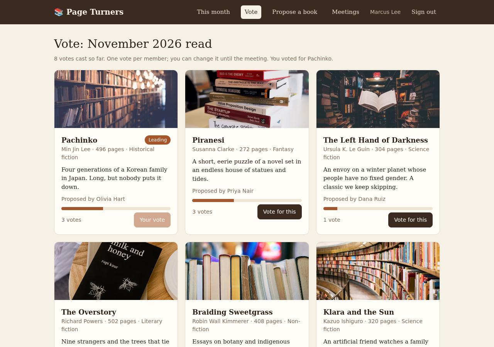

# Page Turners (book club)

Members propose books, vote on next month's read, and RSVP to the monthly meeting.

**Started by:** the Supero team · **Built with:** Claude Code (Claude Opus) · **From brief:** [Book club](../../../projects/community/book-club.md) · **Contributors:** none yet

## What it does

- **A workflow:** each new RSVP triggers a small workflow that marks it processed.
- **This month:** the selected book and the next meeting.
- **Vote:** one vote per member for next month's read, changeable until the meeting, with a running tally.
- **Propose a book:** title, author and a short pitch.
- **Meetings:** past and coming meetings, with an RSVP of yes, no or maybe.

## Who uses it, and who can see what

- **Member**: proposes books, votes, RSVPs. Sees every proposal and the tally. Can change only their own vote and RSVP.
- **Organiser**: everything a member can do, plus scheduling meetings.

## Try it

Deploy it into your own project with the prompt in [apps/README.md](../../README.md#run-one). The bundle's schemas use the namespace `lumen`; the prompt tells your assistant to change that to your project's. Then sign in as:

| Role | Email | Password |
|---|---|---|
| Organiser | `organizer@pageturners.club` | `Password123!` |
| Member | `member@pageturners.club` | `Password123!` |

These are demo accounts with a public password. The bundle also seeds a `developer` test account. Remove or change all three before real users arrive.

## Known gaps

This is where you come in. Each of these is a good first contribution.

- [ ] **The workflow is a token one.** When a member RSVPs, a workflow stamps the RSVP as processed. The brief suggests something useful, such as a reminder to members who have not RSVPed (sent only to their own signed-in address).
- [ ] **The organiser cannot open or close a voting round.** Voting is always open. The brief's "votes cannot be cast after the round closes" is not met.
- [ ] **A member can vote once per round only because the screen says so.** Nobody has checked that a second vote sent straight to the API is refused.
- [ ] **A member cannot withdraw a vote or an RSVP**, only change it.
- [ ] **No reading history.** Books that were read are stored but there is no screen for them.
- [ ] **The sign-in screen does not show the demo accounts**, so a visitor to a preview has to be told them.
- [ ] **No tests.** `build_e2e_test` was never run against it.

## Notes from the build

Built on 5 October 2026 from the one-paragraph brief, with a project key.

- 46 tool calls, 16 minutes from the first call to a checked app. Each deploy took about three and a half minutes to come up.
- `build_validate`, `build_doctor` and `build_publish` passed first time.
- The first deploy reported success but was missing 8 of its starter records. `build_logs` showed why (`SEED FAILURES`), and deploying again filled the gaps. Look at the app, not only at the status.
- After the second deploy, the old version was served for about 100 seconds. Wait, then run `build_smoke_test` again.
- The workflow was added on 6 October, after a platform fix. The app was then wiped and deployed twice with a project key: all 27 starter records were created both times and the workflow ran on a new RSVP.
- The assistant chose to keep each vote and RSVP as its own record that everyone can read, and to store the member's name on it, so the tally works without extra lookups.
